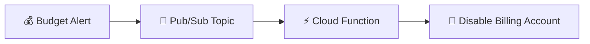
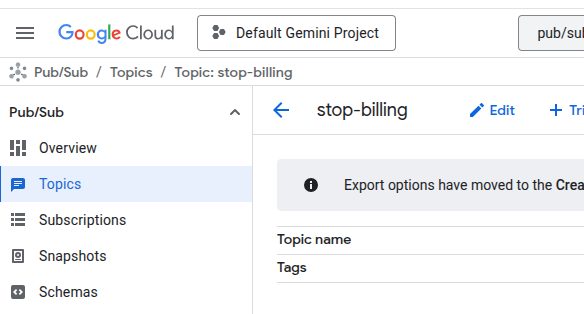
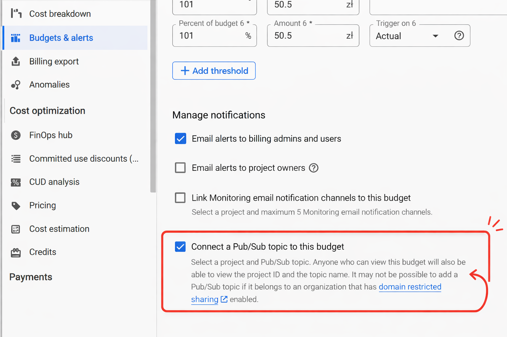
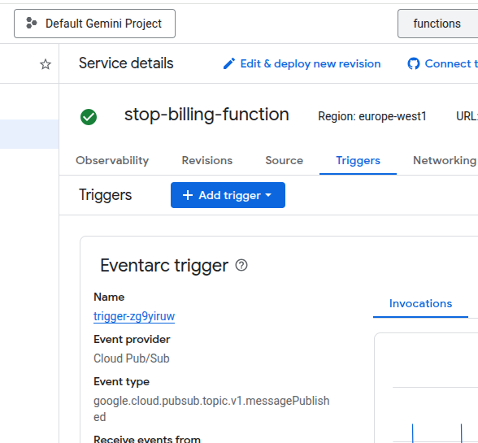

# How to Automatically Disable Google Cloud Billing When Budget Is Exceeded

If you need help or just want to connect, feel free to reach out to me on [LinkedIn Amadeusz Iwanowski](https://www.linkedin.com/in/amadeusz-iwanowski/).

Protect yourself from unexpected Google Cloud costs by automatically disabling billing when your spending approaches the budget limit.

## Architecture



Google Cloud Budget sends an alert to a Pub/Sub topic when spending crosses a threshold. A Cloud Function subscribed to that topic receives the message and detaches the Billing Account from the project, effectively stopping all paid services.

## Prerequisites

- A Google Cloud project with billing enabled
- `gcloud` CLI installed and authenticated
- Permissions: `roles/billing.admin` or `roles/billing.projectManager`

## Step-by-step Setup

### 1. Set environment variables

```bash
export PROJECT_ID="your-project-id"
export BILLING_ACCOUNT_ID="your-billing-account-id"  # format: XXXXXX-XXXXXX-XXXXXX

gcloud config set project $PROJECT_ID
```

### 2. Enable required APIs

```bash
gcloud services enable \
  cloudbilling.googleapis.com \
  cloudfunctions.googleapis.com \
  cloudresourcemanager.googleapis.com \
  pubsub.googleapis.com \
  run.googleapis.com \
  cloudbuild.googleapis.com \
  eventarc.googleapis.com
```

### 3. Create a Pub/Sub topic

```bash
gcloud pubsub topics create stop-billing
```



### 4. Create a Budget with Alert linked to Pub/Sub

1. Go to [Billing → Budgets & alerts](https://console.cloud.google.com/billing/budgets) in the Google Cloud Console.
2. Click **Create Budget**.
3. Set the **scope** to your project.
4. Set the **budget amount** (e.g. $10).
5. Under **Manage notifications**, check **Connect a Pub/Sub topic to this budget**.
6. Select the `stop-billing` topic you created.
7. Optionally adjust threshold rules (default: 50%, 90%, 100%).
8. Click **Finish**.



> You can also create a budget via `gcloud`:
>
> ```bash
> gcloud billing budgets create \
>   --billing-account=$BILLING_ACCOUNT_ID \
>   --display-name="Auto-disable budget" \
>   --budget-amount=10.00USD \
>   --threshold-rule=percent=0.85,basis=current-spend \
>   --threshold-rule=percent=1.0,basis=current-spend \
>   --notifications-rule-pubsub-topic=projects/$PROJECT_ID/topics/stop-billing \
>   --notifications-rule-monitoring-notification-channels=""
> ```

### 5. Deploy the Cloud Function

The function source is in this repository. Deploy it with:

```bash
gcloud functions deploy stop-billing-function \
  --gen2 \
  --runtime=python312 \
  --region=europe-west1 \
  --source=src/ \
  --entry-point=stop_billing \
  --trigger-topic=stop-billing
```



### 6. Grant the Cloud Function permission to manage billing

The Cloud Function's service account needs permission to unlink billing from the project.

```bash
# Get the service account used by the function
SA=$(gcloud functions describe stop-billing-function --region=europe-west1 --gen2 --format='value(serviceConfig.serviceAccountEmail)')

# Grant the billing projectManager role
gcloud projects add-iam-policy-binding $PROJECT_ID \
  --member="serviceAccount:$SA" \
  --role="roles/billing.projectManager"
```

### 7. Test the function

Send a simulated budget notification to verify everything works:

```bash
gcloud pubsub topics publish stop-billing --message='{
  "budgetDisplayName": "Test Budget",
  "costAmount": 9.50,
  "budgetAmount": 10.00,
  "currencyCode": "USD"
}'
```

Check the function logs:

```bash
gcloud functions logs read stop-billing-function --region=europe-west1 --gen2 --limit=10
```

You should see `Billing disabled for your-project-id` if the cost exceeds 85% of the budget.

## How It Works

The Cloud Function ([`src/main.py`](src/main.py)) does the following:

1. Receives a Pub/Sub message triggered by a budget alert.
2. Decodes the message and extracts `costAmount` and `budgetAmount`.
3. If the cost is **≥ 85%** of the budget, it calls the Cloud Billing API to detach the billing account from the project.
4. Once billing is detached, all paid resources in the project are stopped.

The threshold is set to 85% by default because budget alerts can be delayed — acting before 100% gives a safety margin.

```python
import base64
import json

import functions_framework
from googleapiclient import discovery

PROJECT_ID = "your-project-id"
PROJECT_NAME = f"projects/{PROJECT_ID}"

THRESHOLD = 0.85


@functions_framework.cloud_event
def stop_billing(cloud_event):
    """Triggered by a Pub/Sub message from a billing budget alert.
    Disables billing for the project when cost reaches the threshold."""
    pubsub_data = base64.b64decode(
        cloud_event.data["message"]["data"]
    ).decode("utf-8")
    pubsub_json = json.loads(pubsub_data)

    cost = pubsub_json["costAmount"]
    budget = pubsub_json["budgetAmount"]

    if cost < budget * THRESHOLD:
        print(f"No action needed. Cost: {cost}, Budget: {budget}")
        return

    billing = discovery.build("cloudbilling", "v1", cache_discovery=False)
    billing_info = (
        billing.projects().getBillingInfo(name=PROJECT_NAME).execute()
    )

    if not billing_info.get("billingEnabled"):
        print("Billing already disabled")
        return

    billing.projects().updateBillingInfo(
        name=PROJECT_NAME,
        body={"billingAccountName": ""},
    ).execute()
    print(f"Billing disabled for {PROJECT_ID}")
```

## Important Warnings

- **Disabling billing stops paid services.** VMs will be shut down, Cloud SQL instances suspended, etc. Only use this on development/testing projects.
- **Budget notifications can be delayed** by several hours. This is not a hard spending cap — it's a best-effort safety net.
- **Re-enable billing** manually in the Console after investigating the costs:
  [Billing → Account Management](https://console.cloud.google.com/billing)

## Project Structure

```
.
├── img/                # Screenshots from Google Cloud Console
├── src/
│   ├── main.py             # Cloud Function source code
│   └── requirements.txt    # Python dependencies
├── LICENSE
└── README.md           # This file
```

## License

MIT
